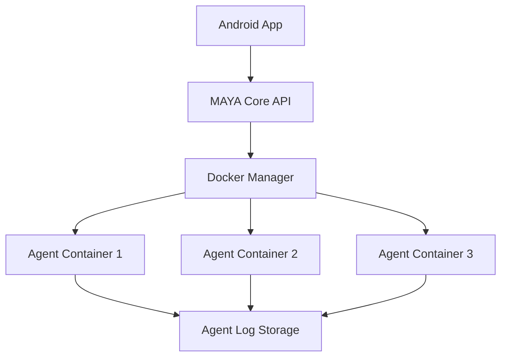

# MAYA Phase 2: Dockerized Autonomous Agent System Design

## 1. Overview

This document outlines the design for Phase 2 of the MAYA project, which involves transforming the MVP into a production-ready, Dockerized system with autonomous agents that follow MAYA's canonical rules. The system will consist of containerized agents that communicate with the MAYA Core via REST APIs.

The implementation will be completed in 3 days as outlined in the inc.md file:
- Day 1: Dockerize agents with canonical endpoints
- Day 2: Android UI + concurrency limiter
- Day 3: Heartbeat scheduler + treasury integration

This document focuses on Day 1 implementation which involves:
- Creating Dockerfile for Faucet-Harvester agent
- Implementing canonical endpoints (/probe, /log, /kill)
- Updating MAYA Core to manage Docker containers
- Testing the full flow of container lifecycle management

## 2. Architecture

The system follows a microservices architecture with the following components:



### Component Description:
- **MAYA Core API**: Central FastAPI service that manages agent lifecycle and provides endpoints for the Android app
- **Docker Manager**: Component within MAYA Core that handles Docker container orchestration
- **Agent Containers**: Independent Docker containers running autonomous agents with standardized endpoints
- **Android App**: Mobile interface that displays proposals and agent logs

## 3. API Endpoints Reference

### 3.1 MAYA Core Endpoints

| Endpoint | Method | Description | Authentication |
|----------|--------|-------------|----------------|
| `/proposals` | GET | Retrieve list of agent proposals scored by ROI/Risk/Time | None |
| `/agents/run` | POST | Start a new agent container | None |
| `/agents/logs` | GET | Retrieve logs from active agent containers | None |
| `/heartbeat` | GET | System health check and agent reindexing | None |

### 3.2 Agent Container Endpoints

| Endpoint | Method | Description | Authentication |
|----------|--------|-------------|----------------|
| `/probe` | GET | Retrieve agent opportunity details and metrics | None |
| `/log` | GET | Retrieve agent activity logs | None |
| `/kill` | POST | Gracefully terminate the agent | None |

## 4. Data Models

### 4.1 Proposal Model
```json
{
  "id": "string",
  "name": "string",
  "description": "string",
  "roi_hrs": "number",
  "risk": "string",
  "cost": "number"
}
```

### 4.2 Agent Probe Response
```json
{
  "opportunity": {
    "id": "string",
    "name": "string",
    "description": "string"
  },
  "cost": "number",
  "roi_hrs": "number",
  "runtime_hrs": "number"
}
```

### 4.3 Log Response
```json
{
  "logs": ["string"]
}
```

## 5. Business Logic Layer

### 5.1 Docker Container Management
The MAYA Core will manage agent containers through the Docker Manager component:
- Container creation and startup
- Container termination and cleanup
- Container health monitoring
- Log retrieval from containers

### 5.2 Agent Lifecycle Management
- Agents must declare `cost: 0` to comply with Zero-Capital Rule
- Agents must implement heartbeat mechanism (every 10 minutes)
- Agents are automatically killed after 24 hours or inactivity
- System enforces 3-agent concurrency limit

### 5.3 Proposal Scoring Algorithm
Proposals are scored using the formula: `(ROI ÷ Risk ÷ Time)`
- ROI (Return on Investment) per hour
- Risk factor (low/medium/high)
- Time factor (runtime hours)

## 6. Middleware & Interceptors

### 6.1 CORS Middleware
Configured to allow Android app connections:
```python
app.add_middleware(
    CORSMiddleware,
    allow_origins=["*"],
    allow_methods=["*"],
    allow_headers=["*"],
)
```

### 6.2 Docker Command Execution
Subprocess-based execution of Docker commands for container management.

## 7. Testing

### 7.1 Unit Tests

#### 7.1.1 Agent Container Tests
- Verify `/probe` endpoint returns correct opportunity data
- Verify `/log` endpoint returns recent log entries
- Verify `/kill` endpoint terminates container gracefully

#### 7.1.2 MAYA Core Tests
- Verify agent container creation and startup
- Verify log retrieval from containers
- Verify container cleanup on restart
- Verify concurrency limit enforcement

### 7.2 Integration Tests
- End-to-end container lifecycle management
- Android app communication with MAYA Core
- Proposal scoring algorithm validation

## 8. Implementation Plan (Day 1 - Dockerization)

### 8.1 Task 1: Create Dockerfile for Faucet-Harvester

In `maya-core/agents/`, create a new directory `faucet_harvester/` with the following structure:
```
maya-core/agents/faucet_harvester/
├── Dockerfile
├── agent.py
├── log.txt
└── requirements.txt
```

#### Dockerfile
```dockerfile
FROM python:3.11-alpine

WORKDIR /app

COPY requirements.txt .
RUN pip install --no-cache-dir -r requirements.txt

COPY agent.py .
COPY log.txt .

EXPOSE 8080

CMD ["python", "agent.py"]
```

#### requirements.txt
```
fastapi
uvicorn
```

#### agent.py (rewritten with canonical endpoints)
```python
from fastapi import FastAPI
import uvicorn
import time
import random
import os
import threading

app = FastAPI()

LOG_FILE = "log.txt"
START_TIME = time.time()
RUNNING = True

# Write initial log
with open(LOG_FILE, "w") as f:
    f.write(f"[{time.ctime()}] Agent started. PID: {os.getpid()}\n")

@app.get("/probe")
def probe():
    runtime_hrs = (time.time() - START_TIME) / 3600
    return {
        "opportunity": {
            "id": "A-01",
            "name": "Faucet-Harvester",
            "description": "Claims testnet ETH every 10 min."
        },
        "cost": 0,
        "roi_hrs": round(0.3 * (1 + random.random()), 2),  # Simulate variance
        "runtime_hrs": round(runtime_hrs, 2)
    }

@app.get("/log")
def get_log():
    if not os.path.exists(LOG_FILE):
        return {"logs": []}
    with open(LOG_FILE, "r") as f:
        lines = f.readlines()[-50:]
    return {"logs": [line.strip() for line in lines]}

@app.post("/kill")
def kill():
    global RUNNING
    RUNNING = False
    with open(LOG_FILE, "a") as f:
        f.write(f"[{time.ctime()}] Received kill signal. Shutting down gracefully.\n")
    # Schedule shutdown in 5s
    threading.Timer(5.0, lambda: os._exit(0)).start()
    return {"status": "shutting down in 5s"}

# Background heartbeat writer
def heartbeat():
    while RUNNING:
        time.sleep(10)  # 🔥 For demo. Change to 600 later.
        with open(LOG_FILE, "a") as f:
            f.write(f"[{time.ctime()}] HEARTBEAT: Still alive. Wallet: 0x{''.join(random.choices('0123456789abcdef', k=40))}\n")

threading.Thread(target=heartbeat, daemon=True).start()

if __name__ == "__main__":
    uvicorn.run(app, host="0.0.0.0", port=8080)
```

### 8.2 Task 2: Build + Run Docker Container

Commands to execute:
```powershell
cd maya-core/agents/faucet_harvester
docker build -t maya-agent-a01 .
docker run -d -p 8080:8080 --name a01 maya-agent-a01
```

Testing endpoints:
- `http://localhost:8080/probe` → returns structured opportunity
- `http://localhost:8080/log` → shows logs
- `curl -X POST http://localhost:8080/kill` → kills container in 5s

### 8.3 Task 3: Update MAYA Core to Manage Docker Agents

Update `maya-core/main.py` to replace agent logic with Docker control:

```python
import subprocess
import json
from fastapi import FastAPI
from fastapi.middleware.cors import CORSMiddleware

app = FastAPI()

# Allow Android to connect
app.add_middleware(
    CORSMiddleware,
    allow_origins=["*"],
    allow_methods=["*"],
    allow_headers=["*"],
)

# In-memory agent state
AGENT_RUNNING = False

@app.get("/proposals")
def get_proposals():
    return [{
        "id": "A-01",
        "name": "Faucet-Harvester",
        "description": "Claims ETH from testnet faucets every 10 min.",
        "roi_hrs": 0.3,
        "risk": "low",
        "cost": 0
    }]

# Replace /agents/run
@app.post("/agents/run")
def run_agent():
    # Kill old if exists
    subprocess.run("docker rm -f a01 2>nul", shell=True)
    # Start new
    result = subprocess.run(
        "docker run -d -p 8080:8080 --name a01 maya-agent-a01",
        shell=True, capture_output=True, text=True
    )
    if result.returncode != 0:
        return {"status": "error", "msg": result.stderr}
    return {"status": "started", "container_id": result.stdout.strip()}

# Replace /agents/logs
@app.get("/agents/logs")
def get_logs():
    result = subprocess.run(
        "curl -s http://localhost:8080/log",
        shell=True, capture_output=True, text=True
    )
    if result.returncode != 0:
        return {"logs": ["Agent unreachable"]}
    try:
        data = json.loads(result.stdout)
        return data
    except:
        return {"logs": ["Failed to parse agent logs"]}

@app.get("/heartbeat")
def heartbeat():
    # Simulate re-indexing every 10 min
    return {
        "status": "alive",
        "last_indexed": time.ctime(),
        "agents_queued": 1,
        "running": 1 if AGENT_RUNNING else 0
    }

if __name__ == "__main__":
    import uvicorn
    uvicorn.run(app, host="0.0.0.0", port=8000)
```

### 8.4 Task 4: Restart MAYA Core + Test Full Flow

Commands to execute:
```powershell
python main.py
```

Then:
```powershell
curl -X POST http://localhost:8000/agents/run
```

Expected results:
- Should start Docker container
- `http://localhost:8000/agents/logs` → should show Docker agent logs

## 9. Testing

### 9.1 Unit Tests

#### 9.1.1 Agent Container Tests
- Verify `/probe` endpoint returns correct opportunity data
- Verify `/log` endpoint returns recent log entries
- Verify `/kill` endpoint terminates container gracefully

#### 9.1.2 MAYA Core Tests
- Verify agent container creation and startup
- Verify log retrieval from containers
- Verify container cleanup on restart
- Verify concurrency limit enforcement

### 9.2 Integration Tests
- End-to-end container lifecycle management
- Android app communication with MAYA Core
- Proposal scoring algorithm validation

## 10. Implementation Files

The following files need to be created in the project structure:

### 10.1 Directory Structure
```
maya-core/agents/faucet_harvester/
├── Dockerfile
├── agent.py
├── log.txt
└── requirements.txt
```

### 10.2 File Contents

#### Dockerfile
```dockerfile
FROM python:3.11-alpine

WORKDIR /app

COPY requirements.txt .
RUN pip install --no-cache-dir -r requirements.txt

COPY agent.py .
COPY log.txt .

EXPOSE 8080

CMD ["python", "agent.py"]
```

#### requirements.txt
```
fastapi
uvicorn
```

#### agent.py
```python
from fastapi import FastAPI
import uvicorn
import time
import random
import os
import threading

app = FastAPI()

LOG_FILE = "log.txt"
START_TIME = time.time()
RUNNING = True

# Write initial log
with open(LOG_FILE, "w") as f:
    f.write(f"[{time.ctime()}] Agent started. PID: {os.getpid()}\n")

@app.get("/probe")
def probe():
    runtime_hrs = (time.time() - START_TIME) / 3600
    return {
        "opportunity": {
            "id": "A-01",
            "name": "Faucet-Harvester",
            "description": "Claims testnet ETH every 10 min."
        },
        "cost": 0,
        "roi_hrs": round(0.3 * (1 + random.random()), 2),  # Simulate variance
        "runtime_hrs": round(runtime_hrs, 2)
    }

@app.get("/log")
def get_log():
    if not os.path.exists(LOG_FILE):
        return {"logs": []}
    with open(LOG_FILE, "r") as f:
        lines = f.readlines()[-50:]
    return {"logs": [line.strip() for line in lines]}

@app.post("/kill")
def kill():
    global RUNNING
    RUNNING = False
    with open(LOG_FILE, "a") as f:
        f.write(f"[{time.ctime()}] Received kill signal. Shutting down gracefully.\n")
    # Schedule shutdown in 5s
    threading.Timer(5.0, lambda: os._exit(0)).start()
    return {"status": "shutting down in 5s"}

# Background heartbeat writer
def heartbeat():
    while RUNNING:
        time.sleep(10)  # 🔥 For demo. Change to 600 later.
        with open(LOG_FILE, "a") as f:
            f.write(f"[{time.ctime()}] HEARTBEAT: Still alive. Wallet: 0x{''.join(random.choices('0123456789abcdef', k=40))}\n")

threading.Thread(target=heartbeat, daemon=True).start()

if __name__ == "__main__":
    uvicorn.run(app, host="0.0.0.0", port=8080)
```

#### log.txt
(Initially empty file)

### 10.3 Updated MAYA Core (main.py)

Replace the existing `maya-core/main.py` with the following updated version:

```python
import subprocess
import json
import time
from fastapi import FastAPI
from fastapi.middleware.cors import CORSMiddleware

app = FastAPI()

# Allow Android to connect
app.add_middleware(
    CORSMiddleware,
    allow_origins=["*"],
    allow_methods=["*"],
    allow_headers=["*"],
)

# In-memory agent state
AGENT_RUNNING = False

@app.get("/proposals")
def get_proposals():
    return [{
        "id": "A-01",
        "name": "Faucet-Harvester",
        "description": "Claims ETH from testnet faucets every 10 min.",
        "roi_hrs": 0.3,
        "risk": "low",
        "cost": 0
    }]

# Replace /agents/run
@app.post("/agents/run")
def run_agent():
    # Kill old if exists
    subprocess.run("docker rm -f a01 2>nul", shell=True)
    # Start new
    result = subprocess.run(
        "docker run -d -p 8080:8080 --name a01 maya-agent-a01",
        shell=True, capture_output=True, text=True
    )
    if result.returncode != 0:
        return {"status": "error", "msg": result.stderr}
    return {"status": "started", "container_id": result.stdout.strip()}

# Replace /agents/logs
@app.get("/agents/logs")
def get_logs():
    result = subprocess.run(
        "curl -s http://localhost:8080/log",
        shell=True, capture_output=True, text=True
    )
    if result.returncode != 0:
        return {"logs": ["Agent unreachable"]}
    try:
        data = json.loads(result.stdout)
        return data
    except:
        return {"logs": ["Failed to parse agent logs"]}

@app.get("/heartbeat")
def heartbeat():
    # Simulate re-indexing every 10 min
    return {
        "status": "alive",
        "last_indexed": time.ctime(),
        "agents_queued": 1,
        "running": 1 if AGENT_RUNNING else 0
    }

if __name__ == "__main__":
    import uvicorn
    uvicorn.run(app, host="0.0.0.0", port=8000)
```

## 11. Deliverables for Day 1

✅ Faucet agent Dockerized with canonical endpoints (`/probe`, `/log`, `/kill`)
✅ MAYA Core spawns/kills Docker containers
✅ Logs flow from container → Core → HTTP
✅ Agent auto-writes heartbeat every 10s