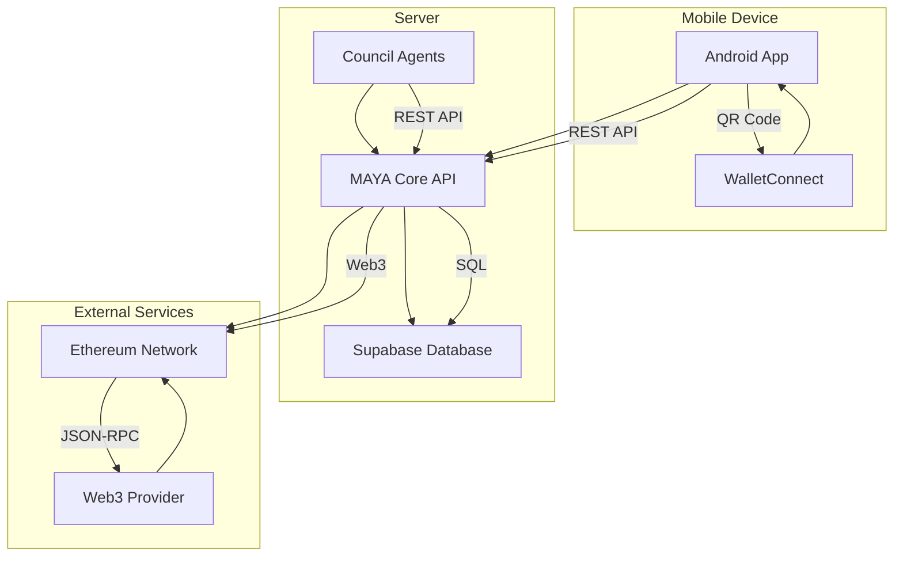

# MAYA King's App MVP Architecture

## Components

### Android App (Kotlin/Jetpack Compose)
- **Main Interface**: Displays the Twelve Councils, proposals, treasury information, and agent logs
- **Navigation**: Main screen with council listing, council details screen, proposal management
- **Data Integration**: Fetches data from backend API via Retrofit
- **Wallet Integration**: WalletConnect v2 for cryptocurrency wallet connection

### MAYA Core API (Python/FastAPI)
- **Framework**: Python FastAPI server running on localhost:8000
- **Authentication**: JWT-based authentication system
- **Data Management**: RESTful endpoints for all entity operations
- **Blockchain Integration**: Web3 integration for Ethereum mainnet connectivity

### Supabase Database (PostgreSQL)
- **Storage**: Stores all data for councils, proposals, treasury transactions, and opportunities
- **Schema**: 
  - `councils` table with 12 predefined councils
  - `proposals` table for funding requests
  - `treasury_transactions` table for financial movements
  - `council_opportunities` table for opportunities

### External Services
- **Ethereum Network**: For real ETH balance and blockchain transactions
- **WalletConnect**: QR code generation and wallet connection

## Data Flow

1. **User Interaction**: User opens Android app and logs in
2. **Data Fetching**: App fetches councils, proposals, and treasury data from MAYA Core API
3. **Database Operations**: MAYA Core API queries/updates Supabase database
4. **Blockchain Operations**: MAYA Core API interacts with Ethereum network for treasury balances
5. **Wallet Connection**: User connects wallet via WalletConnect QR code
6. **Proposal Management**: User reviews and approves/rejects council proposals
7. **Agent Communication**: Council agents report data and submit proposals to MAYA Core API

## API Endpoints

### Council Endpoints
- `GET /supabase/councils` - Get all councils
- `GET /supabase/councils/{council_id}` - Get a specific council
- `POST /supabase/councils` - Create a new council
- `PUT /supabase/councils/{council_id}` - Update a council
- `DELETE /supabase/councils/{council_id}` - Delete a council

### Proposal Endpoints
- `GET /supabase/proposals` - Get all proposals
- `GET /supabase/proposals/{proposal_id}` - Get a specific proposal
- `GET /supabase/proposals/council/{council_id}` - Get proposals for a council
- `POST /supabase/proposals` - Create a new proposal
- `PUT /supabase/proposals/{proposal_id}` - Update a proposal
- `DELETE /supabase/proposals/{proposal_id}` - Delete a proposal

### Treasury Endpoints
- `GET /supabase/treasury-transactions` - Get all treasury transactions
- `GET /supabase/treasury-transactions/{transaction_id}` - Get a specific transaction
- `GET /supabase/treasury-transactions/council/{council_id}` - Get transactions for a council
- `POST /supabase/treasury-transactions` - Create a new transaction

### Opportunity Endpoints
- `GET /supabase/council-opportunities` - Get all council opportunities
- `GET /supabase/council-opportunities/{opportunity_id}` - Get a specific opportunity
- `GET /supabase/council-opportunities/council/{council_id}` - Get opportunities for a council
- `POST /supabase/council-opportunities` - Create a new opportunity
- `PUT /supabase/council-opportunities/{opportunity_id}` - Update an opportunity
- `DELETE /supabase/council-opportunities/{opportunity_id}` - Delete an opportunity